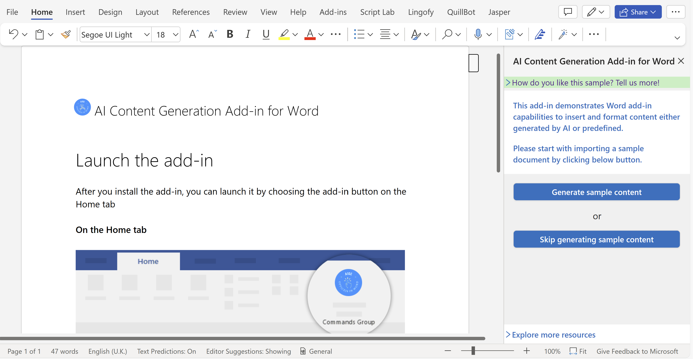
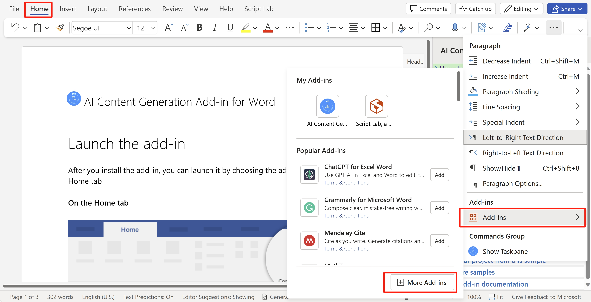

# Create a Word Add-in that produces content

[](https://github.com/microsoftgraph/msgraph-training-office-addin/actions/workflows/node.js.yml) 

This sample shows a practical Word Add-in with content insertion features, utilizing either AI or predefined content. 

## How the sample add-in works
### Features
- Import the document template
- Incorporate content generated by the Azure OpenAI service or predefined titles, comments, and footnotes into the Word document
- Customize the document style
- Insert predefined image into the document

### Play the sample add-in demo
Click the button below and play the sample add-in demo:<br><br>
[](https://office.live.com/start/Word.aspx?culture=en-US&omextemplateclient=Word&omexsessionid=0a1dfc7b-e965-4436-a8a0-2cb908ca19ea&omexcampaignid=none&templateid=WA200006289&templatetitle=AI%20Content%20Generation%20Add-in%20for%20Word&omexsrctype=1)
<br><br>
When you click the button, you will open Word online in a new browser tab, and the sample add-in will launch automatically.
#### Note：
- You need to have a Microsoft 365 account to try the sample. You can [sign up for the Microsoft 365 Developer Program](https://developer.microsoft.com/microsoft-365/dev-program) to get a free Microsoft 365 subscription.
- **[Optional]** If you're interested in exploring AIGC, follow the procedure to request an Azure OpenAI service account. Find more details at [Deploy a model and generate text using Azure OpenAI Service](https://learn.microsoft.com/en-us/azure/ai-services/openai/quickstart?tabs=command-line%2Cpython&pivots=rest-api)

### Expected result


## Build, run and debug the sample code 
### Prerequisites
- You need to have a Microsoft 365 account to launch the sample. You can [sign up for the Microsoft 365 Developer Program](https://developer.microsoft.com/microsoft-365/dev-program) to get a free Microsoft 365 subscription.
- For MacOS only, you need to install [Node.js](https://nodejs.org/) and [git](https://git-scm.com/download/mac) on your computer. To verify if you've already installed these tools, run the commands `node -v` and `git --version` in your terminal.
   
### Run on your local machine
To run the sample on desktop, please follow the steps provided below.

#### Run command below in PowerShell for Windows
   ```
   iwr aka.ms/wordaddin/aigc -outfile wordaigc.bat; saps wordaigc.bat
   ```
This script works in Windows, and it will automatically execute all the required steps for running the sample and opening the code for viewing and editing. The steps include:
- Install Node.js and git if they are not found on your machine.
- Download sample project.
- Launch Visual Studio Code (or launch sample project directory if you don’t have VS Code installed).
- Run the sample automatically if you choose so.

#### Run command below in terminal for MacOS
   ```
   bash <(curl -L -s aka.ms/wordaddin/aigc_mac) 
   ```
This script works in MacOS, and it will automatically execute all the required steps for running the sample and opening the code for viewing and editing. The steps include:
- Download sample project.
- Launch sample project directory（or launch Visual Studio Code if it is installed and configured to support launching from terminal).
- Run the sample automatically if you choose so.
  
Stay tuned for expanded platform support on this command.

### Debug on Word online
To start debug on Word online, please follow the following steps to sideload the `manifest.xml` file on web.<br>
   > 1.  Keep the webpack server on to host your sample add-in.
   > 1.  Open [Office on the web](https://office.live.com/).
   > 1.  Choose **Word**, and then open a new document.
   > 1.  On the **Home** tab, in the **Add-ins** section, choose **Add-ins** and click **More Add-ins** on the lower-right corner to open Add-in Store Page.
        
   >
   > 1.  On the **Office Add-ins** dialog, select the **MY ADD-INS** tab, choose **Manage My Add-ins**, and then **Upload My Add-in**.
        
   >
   > 1.  Browse to the add-in `Word-Scenario-based-Add-in-Samples/Word-Add-in-AIGC/manifest.xml` file, and then select **Upload**.
        
   >
   > 1.  Verify that the add-in loaded successfully. 
6. **[Optional]** If you're interested in exploring AIGC, with prerequisites all satisfied, you can fill in the parameters apiKey, endpoint and deployment in `src/taskpane/components/utility/AIData.tsx` to persist the Azure OpenAI account.
## Additional resources
You may explore additional resources at the following links:
- More samples: [Office Add-ins code samples](https://github.com/OfficeDev/Office-Add-in-samples)
- Office add-ins documentation: [Office Add-ins documentation](https://learn.microsoft.com/en-us/office/dev/add-ins/)

## Feedback
Did you experience any problems with the sample? [Create an issue]( https://github.com/OfficeDev/Word-Scenario-based-Add-in-Samples/issues/new) and we'll help you out.

Let us know your experience using our sample code for Office add-in development: [Sample survey](https://aka.ms/OfficeDevSampleSurvey).

## Copyright
Copyright (c) 2021 Microsoft Corporation. All rights reserved.
This project has adopted the [Microsoft Open Source Code of Conduct](https://opensource.microsoft.com/codeofconduct/). For more information, see the [Code of Conduct FAQ](https://opensource.microsoft.com/codeofconduct/faq/) or contact [opencode@microsoft.com](mailto:opencode@microsoft.com) with any additional questions or comments.
**Note**: The taskpane.html file contains an image URL that tracks diagnostic data for this sample add-in. Please remove the image tag if you reuse this sample in your own code project.

